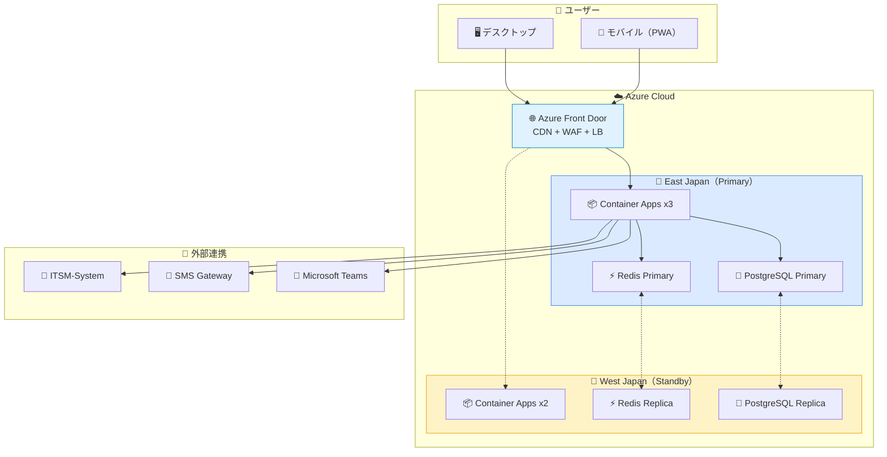
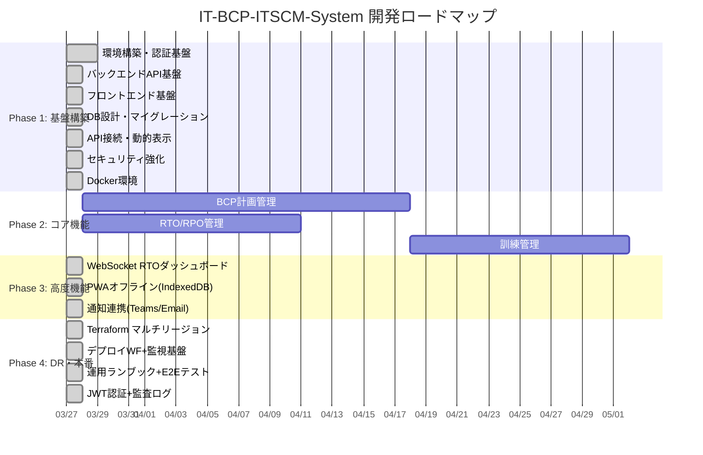
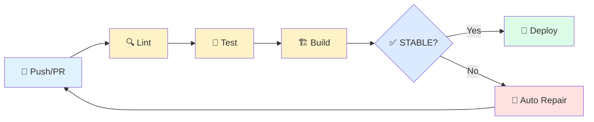
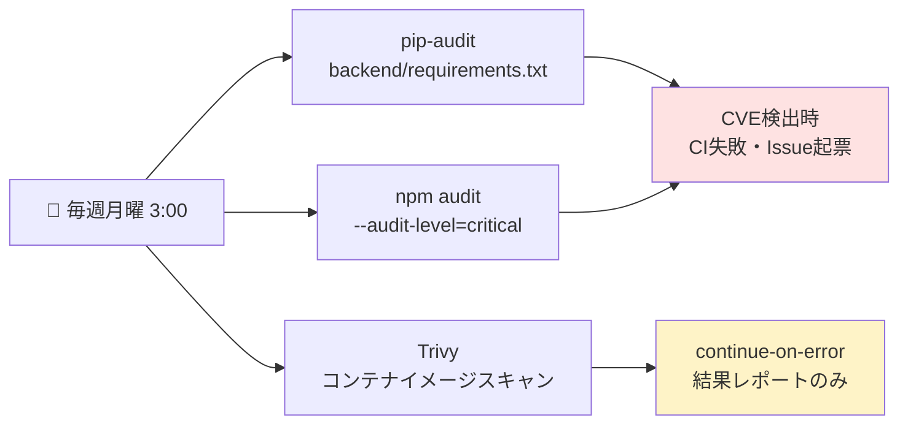
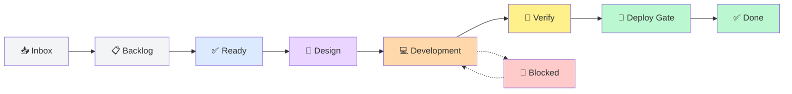

<p align="center">
  <h1 align="center">🛡️ IT-BCP-ITSCM-System</h1>
  <p align="center">
    <strong>IT事業継続管理システム（BCP/ITSCM統合プラットフォーム）</strong>
  </p>
  <p align="center">
    災害・サイバー攻撃時のIT復旧計画・BCP訓練・RTOダッシュボード統合プラットフォーム
  </p>
</p>

<p align="center">
  <a href="https://github.com/Kensan196948G/IT-BCP-ITSCM-System/actions/workflows/claudeos-ci.yml"></a>
  
  
  
  
  
  
</p>

<p align="center">
  
  
  
  
  
  
  
  
</p>

---

## 📋 プロジェクト概要

| 項目 | 内容 |
|:-----|:-----|
| 🏢 **対象組織** | みらい建設工業 IT部門 |
| 📦 **リポジトリ** | `Kensan196948G/IT-BCP-ITSCM-System` |
| 📜 **準拠規格** | ISO20000 ITSCM / ISO27001 A.5.29・A.5.30 / NIST CSF 2.0 RECOVER RC |
| 🟡 **優先度** | 中 |
| 🤖 **開発方式** | ClaudeOS v4 Auto Development Pipeline |

---

## 🏗️ システムアーキテクチャ



### ⚡ フェイルオーバー性能

| 指標 | 目標値 | 設計値 |
|:-----|:------:|:------:|
| 🔄 フェイルオーバー時間 | 15分以内 | **90秒以内** |
| 🔍 障害検知 | - | 30秒 |
| 🌐 DNS切替 | - | 60秒 |
| 💾 データ同期遅延 | 5分以内 | **5秒以内** |
| 📶 オフライン動作 | 必須 | PWA対応 |

---

## ✨ 主要機能

### 📋 BCP/ITSCM計画管理
| 機能 | 説明 | 要件ID |
|:-----|:-----|:------:|
| 📄 IT復旧計画文書管理 | シナリオ別復旧手順書の管理・バージョン管理 | PLAN-001 |
| ⏱️ RTO/RPO管理 | システム別目標復旧時間の管理・可視化 | PLAN-002 |
| 🔄 代替手段管理 | フォールバック手段の登録・管理 | PLAN-003 |
| 📞 緊急連絡網管理 | エスカレーション経路の管理 | PLAN-004 |
| 📊 優先復旧順序管理 | BIAに基づく復旧優先順位 | PLAN-005 |
| 🏢 ベンダー連絡先管理 | IT関連ベンダーの緊急連絡先・SLA情報 | PLAN-006 |

### 🏋️ BCP訓練管理
| 機能 | 説明 | 要件ID |
|:-----|:-----|:------:|
| 🎬 訓練シナリオ管理 | 年次BCP訓練シナリオの作成・管理 | TRN-001 |
| 🗣️ テーブルトップ演習 | シナリオベースの机上演習ツール | TRN-002 |
| 📝 訓練結果記録 | 実施結果・課題・改善事項の記録 | TRN-003 |
| ⏱️ タイムトラッキング | RTO達成状況のリアルタイム記録 | TRN-004 |

### 🚨 インシデント対応（実災害時）
| 機能 | 説明 | 要件ID |
|:-----|:-----|:------:|
| 🎯 緊急対応指揮支援 | 対応状況管理・指揮系統支援 | INC-001 |
| 📊 RTOダッシュボード | 復旧状況のリアルタイム表示 | INC-002 |
| ✅ タスク割当・進捗管理 | 復旧作業のタスク追跡 | INC-003 |
| 📨 状況報告自動化 | 経営層への定期状況報告 | INC-004 |

### 📈 ダッシュボード
| 機能 | 説明 | 要件ID |
|:-----|:-----|:------:|
| 🎯 BCPレディネス | BCP準備状況の総合スコア | RPT-001 |
| 📊 RTO/RPOコンプライアンス | 目標値vs実績値の比較 | RPT-002 |
| 📈 訓練履歴・改善トレンド | 経年変化・改善状況 | RPT-003 |
| 📋 ISO20000準拠レポート | ITSCM要件準拠状況 | RPT-004 |

---

## 🛠️ 技術スタック

| レイヤー | 技術 | バージョン |
|:---------|:-----|:----------|
| 🖥️ フロントエンド | Next.js / TypeScript / Tailwind CSS | 16.x |
| ⚡ バックエンド | Python FastAPI | 0.115.x |
| 🐘 データベース | PostgreSQL（Geo冗長） | 16 |
| ⚡ キャッシュ | Redis Cluster | 7 |
| 📦 タスクキュー | Celery | 5.4 |
| ☁️ インフラ | Azure Container Apps（マルチリージョン） | - |
| 🌐 CDN/LB | Azure Front Door Premium | - |
| 🔧 IaC | Terraform | - |
| 🔄 CI/CD | GitHub Actions | - |
| 📱 PWA | Service Worker + IndexedDB | - |

---

## 📊 対象システムRTO/RPO定義

| システム | RTO目標 | RPO目標 | 重要度 | ステータス |
|:---------|:-------:|:-------:|:------:|:----------:|
| 🔐 Active Directory | 4時間 | 1時間 | 🔴 最高 | 🟢 定義済 |
| ☁️ Entra ID / M365 | SLA依存 | SLA依存 | 🔴 最高 | 🟢 定義済 |
| 📧 Exchange Online | SLA依存 | SLA依存 | 🟠 高 | 🟢 定義済 |
| 📁 ファイルサーバ | 8時間 | 24時間 | 🟠 高 | 🟢 定義済 |
| 📋 DeskNet's Neo | 24時間 | 24時間 | 🟡 中 | 🟢 定義済 |
| 📊 AppSuite | 48時間 | 24時間 | 🟡 中 | 🟢 定義済 |
| 🎫 ITSM-System | 8時間 | 4時間 | 🟠 高 | 🟢 定義済 |
| 🔍 SIEM Platform | 8時間 | 4時間 | 🟠 高 | 🟢 定義済 |

---

## 🚀 開発ロードマップ



### 📌 フェーズ進捗

| フェーズ | 期間 | 進捗 | ステータス |
|:---------|:-----|:----:|:----------:|
| 🏗️ Phase 1: 基盤構築 | 2ヶ月 | ██████████ 100% | ✅ 完了 |
| ⚙️ Phase 2: コア機能 | 3ヶ月 | ██████████ 100% | ✅ 完了 |
| 🚀 Phase 3: 高度機能 | 2ヶ月 | ██████████ 100% | ✅ 完了 |
| 🌐 Phase 4: DR・本番 | 1ヶ月 | ██████████ 100% | ✅ 完了 |

---

## 📂 ディレクトリ構成

```
IT-BCP-ITSCM-System/
├── 📁 docs/                          # プロジェクトドキュメント（46ファイル）
│   ├── 01_計画管理(Planning)/         # プロジェクト計画・ロードマップ（8件）
│   ├── 02_要件定義(Requirements)/     # 要件定義・BIA（5件）
│   ├── 03_設計(Design)/              # アーキテクチャ・DB・API設計（8件）
│   ├── 04_開発ガイド(Development)/    # 環境構築・コーディング規約（4件）
│   ├── 05_テスト(Testing)/           # テスト計画・テストケース（5件）
│   ├── 06_リリース管理(Release)/      # リリース手順・変更管理（6件）
│   ├── 07_運用管理(Operations)/       # 運用手順・監視・DR（5件）
│   └── 08_コンプライアンス(Compliance)/ # ISO/NIST準拠対応表（4件）
├── 📁 backend/                        # Python FastAPI バックエンド
│   ├── apps/                          # アプリケーションモジュール
│   │   ├── models.py                  # SQLAlchemy モデル（3テーブル）
│   │   ├── schemas.py                 # Pydantic スキーマ（バリデーション強化）
│   │   ├── crud.py                    # CRUD操作（ページネーション対応）
│   │   ├── rto_tracker.py             # RTOトラッカー（5ステータス判定）
│   │   └── routers/                   # APIルーター（4ルーター）
│   ├── alembic/                       # DBマイグレーション
│   ├── scripts/                       # シードデータ投入
│   ├── tests/                         # テスト（61件）
│   ├── main.py                        # FastAPI + セキュリティミドルウェア
│   ├── config.py                      # 環境設定
│   ├── database.py                    # DB接続（AsyncSession）
│   └── Dockerfile                     # コンテナビルド
├── 📁 frontend/                       # Next.js 14 フロントエンド
│   ├── app/                           # App Router ページ（7ページ）
│   │   ├── page.tsx                   # ダッシュボード
│   │   ├── plans/                     # BCP計画管理
│   │   ├── exercises/                 # 訓練管理
│   │   ├── incidents/                 # インシデント管理
│   │   ├── rto-monitor/               # RTOモニタリング
│   │   └── components/                # 共通コンポーネント
│   ├── lib/                           # API接続・型定義・フック
│   ├── public/                        # PWA（manifest.json + sw.js）
│   └── Dockerfile                     # コンテナビルド
├── 📁 infrastructure/                 # Terraform IaC
│   └── terraform/                     # Azure マルチリージョン構成
│       ├── main.tf                    # Front Door + East/West Japan
│       └── modules/region/            # リージョンモジュール
├── 📁 scripts/                        # ClaudeOS自動化スクリプト
│   ├── project-sync.sh                # GitHub Project状態同期
│   ├── create-issue.sh                # Issue自動生成
│   └── create-pr.sh                   # PR自動生成
└── 📁 .github/workflows/             # GitHub Actions CI/CD
    └── claudeos-ci.yml                # lint → test → build パイプライン
```

---

## 🔄 CI/CD パイプライン



| ステージ | ツール | 内容 |
|:---------|:-------|:-----|
| 🔍 Lint | ESLint + flake8 + black | コード品質チェック |
| 🧪 Test | pytest + Jest | ユニット・結合テスト |
| 🏗️ Build | next build | フロントエンドビルド |
| ✅ STABLE | ClaudeOS判定 | N回連続CI成功で判定 |

---

## ⚙️ 開発環境セットアップ

### 必要ソフトウェア

| ソフトウェア | バージョン | 用途 |
|:------------|:----------|:-----|
| 🟩 Node.js | 22.x LTS | フロントエンド |
| 🐍 Python | 3.12 | バックエンド |
| 🐘 PostgreSQL | 16 | データベース |
| ⚡ Redis | 7 | キャッシュ |
| 🐳 Docker | latest | コンテナ |

### クイックスタート

```bash
# リポジトリクローン
git clone https://github.com/Kensan196948G/IT-BCP-ITSCM-System.git
cd IT-BCP-ITSCM-System

# バックエンド
cd backend && pip install -r requirements.txt
uvicorn main:app --reload

# フロントエンド
cd frontend && npm install
npm run dev
```

> 📖 詳細な手順は [開発環境構築手順](docs/04_開発ガイド(Development-Guide)/01_開発環境構築手順(Development-Setup).md) を参照してください。

---

## 📜 準拠規格

| 規格 | 対象条項 | 準拠状況 |
|:-----|:---------|:--------:|
| 📘 **ISO20000-1:2018** | ITサービス継続管理 8.7 | 🟢 対応済 |
| 📗 **ISO27001:2022** | A.5.29 事業継続 / A.5.30 ICT継続 | 🟢 対応済 |
| 📙 **NIST CSF 2.0** | RECOVER RC（復旧計画・改善） | 🟢 対応済 |
| 📕 **ITIL v4** | ITサービス継続管理 | 🟢 対応済 |

---

## 🔐 セキュリティ対応状況（2026-04-02 更新）

> ClaudeOS v4 自律開発セッション中に検出・対応した脆弱性のトラッキング
> セキュリティポリシー詳細: [SECURITY.md](./SECURITY.md)

### ✅ 修正済み脆弱性

| パッケージ | 旧バージョン | 新バージョン | CVE/GHSA | 重要度 | 対応日 |
|:-----------|:------------:|:------------:|:---------|:------:|:------:|
| `next` | 14.2.21 | **14.2.35** | [GHSA-f82v-jwr5-mffw](https://github.com/advisories/GHSA-f82v-jwr5-mffw) Authorization Bypass | 🔴 Critical | 2026-04-02 |
| `python-jose` | 3.3.0 | **3.5.0** | PYSEC-2024-232/233 | 🟠 High | 2026-04-02 |
| `black` | 24.10.0 | **26.3.1** | CalVer更新・セキュリティパッチ | 🟡 Medium | 2026-04-02 |
| `SECURITY.md` | — | **新規作成** | ISO 27001 A.5.29脆弱性開示ポリシー整備 | ✅ Compliance | 2026-04-02 |
| mypy strict | 7エラー | **0エラー** | 型安全性向上・type:ignore削除 | ✅ Quality | 2026-04-02 |
| Node.js CI | 20.x | **22.x LTS** | EOL対応・ISO 27001 A.5.30準拠 | ✅ Compliance | 2026-04-02 |
| テストカバレッジ | 86% | **99%** | crud.py 100%（PR#87: CRUD全11エンティティ網羅）、全体99% | ✅ Quality | 2026-04-02 |
| テスト総数 | 149件 | **538件** | PR#87: crud.py 78テスト追加、PR#104: PDFレポートテスト追加、全エンティティCRUD網羅 | ✅ Quality | 2026-04-02 |
| TypeScript | 5.7.x | **6.0.2** | CSS型宣言追加でTS6対応（css.d.ts） | ✅ Quality | 2026-04-02 |
| FastAPI | 0.115.6 | **0.120.4** | CVE-2025-54121/62727解消、starlette 0.49.3固定 | 🔐 Security | 2026-04-02 |
| starlette | 0.41.3 | **0.49.3** | CVE-2025-54121 (fix:0.47.2+) / CVE-2025-62727 (fix:0.49.1+) 解消 | 🔐 Security | 2026-04-02 |

### ✅ 解消済み脆弱性（PR #85 / 2026-04-02）

| パッケージ | CVE | 修正バージョン | 状態 |
|:-----------|:----|:-------------|:----:|
| `starlette` | CVE-2025-54121 | 0.47.2+ → **0.49.3適用** | ✅ 解消 |
| `starlette` | CVE-2025-62727 | 0.49.1+ → **0.49.3適用** | ✅ 解消 |

### ⚠️ 既知の未解消脆弱性（追跡中）

| パッケージ | CVE | 重要度 | 対応方針 | 追跡Issue |
|:-----------|:----|:------:|:---------|:---------:|
| ~~`next`~~ | ~~GHSA-9g9p-9gw9-jx7f 他3件~~ | ~~🟠 High (DoS)~~ | ✅ **PR #86でNext.js 16.2.2へアップグレード解消済み** | ~~[#72](https://github.com/Kensan196948G/IT-BCP-ITSCM-System/issues/72)~~ |

### 🔍 セキュリティスキャン構成



---

## 📊 GitHub Project

🔗 [IT-BCP-ITSCM-System Project Board](https://github.com/users/Kensan196948G/projects/13)

### ステータスフロー



---

## 🔧 最新 Improvement ループ成果（2026-04-02 12:15 JST）

| 改善項目 | 状態 | 詳細 |
|:---------|:----:|:-----|
| 🟢 GitHub Projects #13 | **✅ 整合確認** | GraphQL検証: 全19件 Done済み（CLI誤検知 → 実際は正常） |
| 🟢 systemd BACKEND_URL | **✅ 追加完了** | `/etc/systemd/system/it-bcp-itscm-frontend.service` に環境変数一元化 |
| 🟢 静的アセット自動化 | **✅ 完了** | `scripts/copy-static-assets.sh` 作成 + ExecStartPre 統合（PR不要・直接改善） |
| 🟢 Next.js standalone | **✅ 本番確認** | ExecStartPre SUCCESS・.next/static + public 自動コピー動作確認済み |
| 🟢 コミット | **✅ push済み** | `ca79151` → `origin/main` push完了 |

## 🔍 最新 Monitor ループ状態（2026-04-02 11:40 JST）

| 確認項目 | 状態 | 詳細 |
|:---------|:----:|:-----|
| 🟢 CI (main) | **✅ 全成功** | PR #89 Lint/Test/Build 全パス → main マージ完了 |
| 🟢 テスト | **✅ 459件 全通過** | 0失敗、0エラー |
| 🟢 カバレッジ | **✅ 99%** | crud.py 100% / report_generator 100% / bia_calculator 100% / 全体99% |
| 🟢 オープンPR | **0件** | PR #89(CORS/APIスキーマ修正・全14ページ)マージ済み |
| 🟢 オープンIssue | **0件** | 全Issue解消済み |
| 🟢 セキュリティ | **✅ CVE 0件** | pip-audit: No known vulnerabilities / npm audit: 0 vulnerabilities |
| 🟢 WebUI | **✅ 全14ページ正常** | API接続テスト 14/14 OK、CORS解消、RTOモニタ正常表示 |
| 🟢 GitHub Projects | **Done: 19件** | Blocked/進行中: なし |
| 🟢 STABLE判定 | **✅ STABLE** | CI連続成功・全テスト通過・CVEゼロ・WebUI全ページ確認済み |

### 📌 技術負債トラッキング

| Issue | タイトル | 重要度 | 方針 |
|:-----:|:---------|:------:|:-----|
| ~~[#72](https://github.com/Kensan196948G/IT-BCP-ITSCM-System/issues/72)~~ | ~~Next.js 16 フルエコシステム移行~~ | ~~🟠 High~~ | ✅ **PR#86で解消済み**（Next.js 16.2.2 + React 19.2.4） |
| ~~[#73](https://github.com/Kensan196948G/IT-BCP-ITSCM-System/issues/73)~~ | ~~FastAPI/starlette CVE-2025-54121~~ | ~~🟠 High~~ | ✅ **PR#85で解消済み**（FastAPI 0.120.4 + starlette 0.49.3） |

---

## 📄 ライセンス

MIT License

---

## 🤖 開発体制

**ClaudeOS v4 Auto Development Pipeline** による自律開発

| ループ | 間隔 | 役割 |
|:-------|:----:|:-----|
| 🔍 Monitor | 1h | Projects/Issues/PR/Actions状態監視 |
| 💻 Development | 2h | 設計・実装タスク実行 |
| 🧪 Verify | 2h | テスト/CI/STABLE判定 |
| 🔧 Improvement | 3h | 品質・アーキテクチャ改善 |

---

---

## 📊 最新 Monitor サマリー（2026-04-02 15:45 JST）

| 指標 | 値 | 状態 |
|:-----|:---|:----:|
| テスト数 | **540 passed** / 0 failed | ✅ |
| E2Eテスト | 39 tests (Playwright、live server用) | ✅ |
| カバレッジ | 100% (2535+ stmts) | ✅ |
| Merged PRs | **108** | ✅ |
| Open PRs | 0 | ✅ |
| GitHub Issues | 1 open (#97 Phase3 BIA Cache) | 🔄 |
| Project #13 | Phase 3 完了・Phase 4 準備中 | ✅ |
| セキュリティ | 0 CVE / JWT全ルーター + WebSocket保護済み | ✅ |
| STABLE判定 | **✅ STABLE** (PR #107/#108 全マージ済み) | ✅ |

### Phase 3 セキュリティ・キャッシュ・監査強化 進捗

| タスク | PR | 状態 | 詳細 |
|:-------|:--:|:----:|:-----|
| 🔐 JWT認証全保護ルーター適用 | #94 | ✅ Merged | 11ルーター保護、3公開エンドポイント除外 |
| ⚡ Redisキャッシュモジュール | #94 | ✅ Merged | apps/cache.py、graceful degradation対応 |
| 🎭 Playwright E2Eテスト基盤 | #94 | ✅ Merged | tests/e2e/、39テスト、live server対応 |
| 📊 BIA エンドポイント Redis キャッシュ | #95 | ✅ Merged | /api/bia/summary・/api/bia/risk-matrix、TTL=600s |
| 🔌 WebSocket JWT認証強化 | #96 | ✅ Merged | /ws/rto-dashboard、close 1008 on auth failure |
| ⚡ Systems/Exercises リスト Redis キャッシュ | #98 | ✅ Merged | TTL=300s、ページネーション対応キャッシュキー |
| 🔧 E2E BIA キャッシュテスト分離修正 | #99 | ✅ Merged | ローカルRedis干渉防止・509テスト全通過 |
| 📝 HTTP ミドルウェア監査ログ（ISO27001） | #100 | ✅ Merged | 全CRUD操作自動記録、横断的関心事実装 |
| 📤 CSV エクスポートエンドポイント | #101 | ✅ Merged | systems/exercises/BIA の3エンドポイント追加、515テスト |
| 📥 CSV インポートエンドポイント | #103 | ✅ Merged | systems/exercisesのCSVバルクインポート、バリデーション付き |
| 📄 PDFレポートエクスポート | #104 | ✅ Merged | reportlab使用、RPT-001〜004の4種PDF生成、538テスト |
| 🗄️ 監査ログDB永続化強化 | #105 | ✅ Merged | PostgreSQL永続化・fire-and-forget・ISO20000監査証跡強化 |
| 📊 BCP/ITSCM統計分析API | #106 | ✅ Merged | MTTR・RTO違反率・システム重要度分布、540テスト |
| 🔧 mypy型アノテーション修正(auth/ws) | #107 | ✅ Merged | no-any-return解消・dict[str,Any]型付け強化 |
| 🔌 WebSocket RTO DBバックエンド化 | #108 | ✅ Merged | モックデータ廃止・crud+RTOTracker実クエリ接続 |

<p align="center">
  <sub>Built with ❤️ by ClaudeOS v4 Auto Development Pipeline</sub>
</p>
